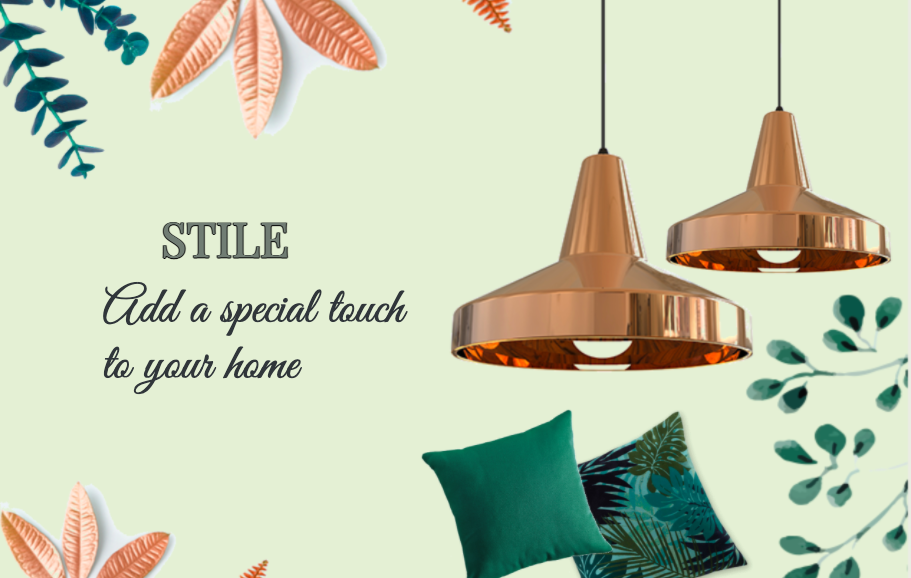
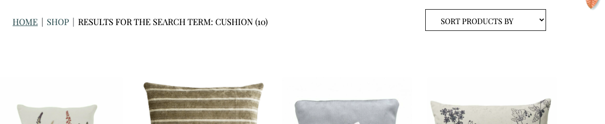
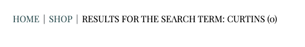
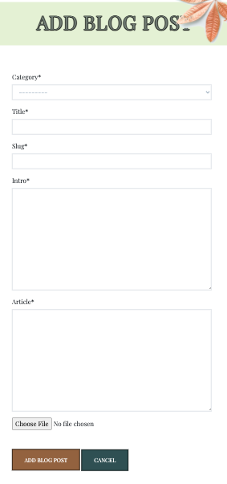
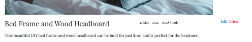
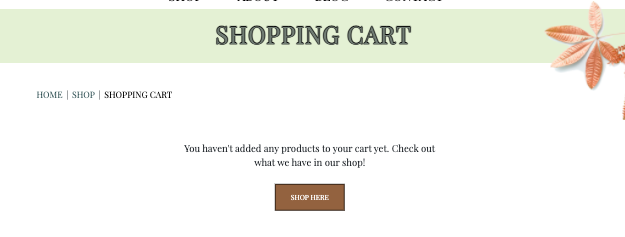
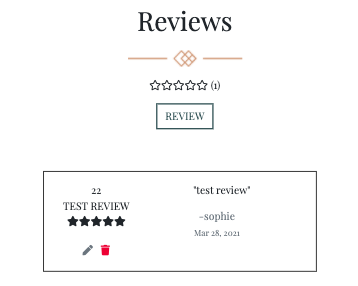

# STILE - E-Commerce Web App.

### Code Institute - Final Milestone Project (4) - Full Stack Frameworks With Django.

STILE is a homeware boutique with hand picked items for you! Our collection ranges from furniture to home decor. The application focuses
on Interior Design, and also a blog page with DIY items you can do from your own home, and also comment and leave some tips for others.

The live website can be found [here](https://stile-boutique.herokuapp.com/)

## Table of Contents

* [Project Summary](#project-summary)
* [User Experience Design (UX)](#user-experience-design)
  * [The Strategy Plane](#the-strategy-plane)
    * [User Stories](#user-stories) 
  * [The Scope Plane](#the-scope-plane)
  * [The Structure Plane](#the-structure-plane)
  * [The Skeleton Plane](#the-skeleton-plane)
    * [Wireframes](#wireframes)
    * [Database Design](#database-design)
    * [Security](#security)
  * [The Surface Plane](#the-surface-plane)
* [Features](#features)
   * [Existing Features](#existing-features)
   * [Future Features](#future-features)
* [Technologies](#technologies)
* [Testing](#testing)
* [Deployment](#deployment)
    * [AWS S3](#aws-s3)
    * [Heroku Deployment](#heroku)
    * [Local Deployment](#local-deployment)
* [Credits](#credits)

****

# Project Summary

Welcome to my Full Stack Frameworks with Django Project for Code Institute.

The goal of this project was to allow the user to create an account and make a purchase of products with Stripe. Although the majority of the admin activities is done through the Django admin site, the web app also provides more pleasant environment for common tasks such as adding, editing and deleting products or blog posts through the web app's UI.
I chose to develop an ecommerce shopping website as it is a complex and flexible application which challenged my understanding of the technologies involved. Given the sensitivity involved in handling customer details 
I had to approach development from a security conscious perspective.

# User Experience Design

## The Strategy Plane

Stile Homeware is a web-shop that represents a stored located in Dublin, Ireland. The customer can successfully purchase items and have them delivered to their home. For more user interaction, I created a blog with a comment section, and also a review option for all the products that is only available to logged in users.

## User Stories

As an e-commerce site owner...

* I want to offer a shopping journey that is informative and transparent so that the customers develop trust towards the marketplace.
* I want to have a marketplace offering more than just products so that the customers will have more reasons to come back to the site.
* I want to be able to make changes on the inventory myself so that I don't have to rely on external support when it comes to that.
* I want to be able to add, edit and adjust blog posts as I wish to do so.
* I want to offer a shopping journey that is informative and easy to navigate through.

As a customer...

* I want the main purpose of the site to be clear so that I immediately know what the site is intended for upon entering.
* I want to easily navigate the site so that I can find content quickly with ease on any device.
* I want to view a list of products or look for an individual item by its category.
* I want to view individual product details and view the shipping and return policy.
* I want to easily view the total of my purchases at any time and have the option to update or delete.
* I want to successfully register for an account and proceed to log in.
* I want to easily access my previous orders.
* I want to be able to store my shipping details so that it’s easier for me to check out.
* I want to be able to contact the store of the website incase I have any issues or questons.
* I want to be able to easily recover my password incase I forget it.

## The Scope Plane 

In designing the page, I wanted for the user to have a positive experience and for the web-site to be simple to use. User can navigate through navigation bar that is always visible and by links in the footer. They can go from any part of the web-site to any other part. Simple to navigate and intuitive.

### Features planned:

* Responsive Design - Site should function on mobile, tablet and desktop/laptop devices.
* Mobile and desktop navigations.
* Website information clearly relayed upon entering the home page.
* Standard e-commerce feed of products with the option to sort products and filter them by category name. 
* Every product can be added to the cart immediately and links to a product page where the user can read more about it.
* About page to inform the user a information about the owners, with a testimonials section.
* Blog page containing blog posts all bout DIY projects to give the user inspiration for their own home.
* Contact information and form to easily contact the store.
* Options for the customers to leave a review on a product.

## The Structure Plane

When the user arrives on site, it will see the hero image and text which invokes the purpose of the site. Below there are three cards for new decor products we have in stock with the title and price. Each card is clickable to the product details. Navigation is always on top of the screen and the sites name acts as a link to Home page.On smaller devices there is a link in the hamburger menu. There is also a link for each section of the website. Also, I have placed main links of the web-site in the footer section as I've seen it in almost all web-sites I have visited.

Shop section is similar to every other web-shop. When they arrive at Shop, they will see all products available. I have put a drop down menu on the shop nav link to filter merchandise by four main categories. Products are presented as cards with images, name, short description and price. If user decides to view product, they willl see full name, full description, price and an option to add product to cart. If user adds to cart, they will see a message at the top of the page informing them that they have put that product with quantity X in their cart. I have included breadcrumbs to redirect the user back to all products page or home.

The about page explains a little about the owners of the website with a paragraph to left of the image of the owners. The testimonal section contains a carousel with a image, the comment and the auther and for now includes three different testimonals.

Blog page has an intro of the type of blogs the site will be submitting. Three images are placed below. Currently there are two blog posts which are in different categorys. The blogs contain a main image, a header, the date and time the blog was submitted and the information. The comment section below allows users to comment their thought on the blog and also give any tips they might want to add.

In a cart section, users can see all the items in their cart and when they change the quantity of it, it shows instantly. Once user is ready for checkout, they will see a form which they have to fill in order for the checkout to be completed. Once completed, the order will be stored in Account > Order History and user can see it anytime.

After every user input, submission, registration, login, comment, reply they are notified by a message from the web-site that briefly describes the action taken so that user knows their action was properly submitted.

## The Skeleton Plane

### Wireframes

Since this is a big project, I have decided to put wireframes in separate file.

You can access them [here](wireframes.md).

### Database Design

As Django works with SQL databases by default, I was using SQLite in development. Heroku, however, provides a PostgreSQL database for deployment

### User Model

The User model utilized for this project is the standard one provided by `django.contrib.auth.models`

### Profiles App

| Name | Database Key | Field Type | Type Validation |
| :-------------: |:----------------:| :--------------: | :---------: |
|User | user |	OneToOneField 'User'| on_delete=models.CASCADE
|Default Phone Number |	default_phone_number | CharField | max_length=20, null=True, blank=True
|Default Country | default_country | CountryField | blank_label='country', null=True, blank=True
|Default Postcode | default_postcode | CharField | max_length=20, null=True, blank=True
|Default Town or City | default_town_or_city | CharField | max_length=40, null=True, blank=True
|Default Street Address1 | default_street_address1 | CharField | max_length=80, null=True, blank=True
|Default Street Address2 | default_street_address2 | CharField | max_length=80, null=True, blank=True

### Products App

`Category` model

| Name | Database Key | Field Type | Type Validation |
| :-------------: |:----------------:| :--------------: | :---------: |
|Name | name | CharField | max_length=254
|Friendly Name | friendly_name | CharField | max_length=254, null=True, blank=True

`Product` model

| Name | Database Key | Validation | Field Type|
| :-------------: |:----------------:| :--------------: | :---------: |
|Product id | id | primary_key=True | AutoField
|Name | name | default='', max_length=254 | CharField
|SKU | sku | max_length=254, null=True, blank=True | CharField
|Description | content | blank=False | TextField
|Price | price | max_digits=6, decimal_places=2 | DecimalField
|Image| image| blank=False | ImageField
|Rating | rating | blank=True | DecimalField

### Review

| Name | Database Key | Validation | Field Type|
| :-------------: |:----------------:| :--------------: | :---------: |
|User | user | on_delete=models.CASCADE | ForeignKey
|Product| product | Product, related_name="review" | ForeignKey
|Title | title | max_length=50 | CharField
|Description| description | description | TextField
|Rating | rating | choices=RATE | IntegerField
|Upvotes | upvotes | default=0 | IntegerField
|Downvotes| downvotes | default=0 | IntegerField
|date_posted | date_posted | auto_now_add=True| DateTimeField

### Post

| Name | Database Key | Validation | Field Type|
| :-------------: |:----------------:| :--------------: | :---------: |
|id | id | primary_key=True | AutoField
|Category| category | on_delete=models.CASCADE | ForeignKey
|Title | title | max_length=100 | CharField
|Slug | slug | max_length=200, unique=True | SlugField
|Intro | intro | validators=[MinLengthValidator(100)], max_length=400 | TextField
|Article | article | validators=[MinLengthValidator(250)]| TextField
|Image| image | blank=True | ImageField
|Date_added| date_added| auto_now_add=True | DateTimeField

### Category_post

| Name | Database Key | Validation | Field Type|
| :-------------: |:----------------:| :--------------: | :---------: |
|Title | title | max_length=100 | CharField
|Slug | slug | max_length=200, unique=True | SlugField

### Comment

| Name | Database Key | Validation | Field Type|
| :-------------: |:----------------:| :--------------: | :---------: |
|Post | post | pon_delete=models.CASCADE | ForeignKey
|Name | name | max_length=255  | CharField
|Article | article | blank=False  | TextField
|Date| date_added | auto_now_add=True | DateTimeField

### Order

| Name | Database Key | Validation | Field Type|
| :-------------: |:----------------:| :--------------: | :---------: |
|Order id | id | primary_key=True | AutoField
|User | user | User, on_delete=models.CASCADE, related_name="orders" | ForeignKey(User)
|Full name | full_name | max_length=50 | CharField
|Phone number | phone_number | max_length=20, blank=False | CharField
|Country | country | max_length=40, blank=False | CharField
|Postcode | postcode| max_length=40, blank=True | CharField
|Town or City | town_or_city | max_length=40, blank=False | CharField
|Street address 1 | street_address1 | max_length=40, blank=False | CharField
|Street address 2 | street_address2 | max_length=40, blank=False | CharField
|County | county | max_length=40, blank=False | CharField
|Date | date | default=timezone.now | DateField
|Total price | total_price | max_digits=100, decimal_places=2, default=0.00 | DecimalField

### OrderLineItem

| Name | Database Key | Validation | Field Type|
| :-------------: |:----------------:| :--------------: | :---------: |
|Order Line Item id | id | primary_key=True | AutoField
|Order | order | Order, related_name="orderline", null=False | ForeignKey
|Product | product | Product, null=False | ForeignKey
|Quantity | quantity | blank=False | IntegerField

### Security

Using config variables in heroku, all SECRET access keys are stored safely to prevent unwanted connections to the database.

Django allauth was used to set up user registration and built in decorators allowed restricted access to certain features on the website that are not intended for regular users.

## The Surface Plane

### Colour Scheme

My inspiration for my site was taken from a colour pallett found on [Coloors](https://coolors.co/palettes/trending).

I loved the contrast of the browns and greens so I decided to go with the following colours in my project.

* The darker green used throughout the site is #354F52.
* I used a light green to compliment the darker green #E6EFD6.
* The brown shade used to give contrast is #8D6346. 

### Typography

The main font used throughout the website is 'Playfair Display'. The cursive text I used to give contrast and compliment this font is 'Great Vibes'.

### Images

I used different websites for inspiration and images on my homeware site:
* [Unsplash](https://unsplash.com/)
* [Anthropologie](https://www.anthropologie.com/?ref=logo)
* [Nook Home](https://www.nookhome.ie/OUR-SHOP/)
* [Maisons](https://www.maisonsdumonde.com/UK/en?awc=7512_1614608739_df38ef9cbc28502edce263f7d26b59ab&utm_source=awin_uk&utm_medium=affiliation&utm_campaign=generique&utm_content=The%20Telegraph)

# Features

## Existing Features

Web App Sections:
* Navigation bar
    * Navigation bar is visible on all pages and on all sizes (on a smaller width, it toggles into "hamburger"). It contains web-site logo and a set of links for each section and subsection of web-site.

* Footer section
    * Footer section contains three sections, the first section links to different sections of web-site, the section contains the stores location and the final section gives users the option to stay up to date with the app via links to social media profiles.

* Webshop
    * Standard e-commerce feed of products with the option to sort products and filter them by category name and price. Every product can be added to the cart immediately and links to a product page where the user can read more about it, including picture of product, name, description, price and an add button if they would like to add product.

* About page
    * Gives information on the two owners of the website. Testimonals are below in a carousel.

* Blog
    * A section containing all the blog posts with the focus on DIY projects a user can re-create from their own home.

* User account 
    * Available to registered/logged in users with the purpose of tracking their order history and safely storing shipping details for a smooth checkout.

* Admin account
    * Available users with admin rights with the purpose of having access to the orders, user profiles, as well as product and blog inventory. Majority of the information is stored in the Django admin site but the users can also do common tasks such as adding, editing and deleting products or blog posts through the site.

## Features and Django Apps

STILE, [A Django project](https://docs.djangoproject.com/en/3.1/ref/applications/), consists of 9 Django applications listed below. As explained in Django's documentation - a Django application describes a Python package that provides some set of features. Applications may be reused in various projects.

* `about`
* `bag`
* `blog`
* `checkout`
* `contact`
* `home`
* `products`
* `profiles`
* `reviews`

The following list of features is structured in a way that should help with understanding how the features are spread throughout the project.

### Search functionality

* A Search box is part of the top navigation and is, therefore, accessible on all pages.
* On mobile and ipad the search bar is collapsed under the search symbol.
* It allows customers to enter keywords associated with the products they wish to purchase.
* The search results are displayed as a feed of products by using the page templates prepared for the `products` Django app.
 

### Breadcrumbs

* Breadcrumbs are present throughout the `products` (i.e. webshop), `cart` and `checkout` Django apps and, additionally, throughout the `profiles` app.

* The purpose of this feature is to ease the navigation across STILE only where navigation links might not be as helpful. Therefore, breadcrumbs don't appear on every webpage.

### Toasts

* Small snippets of messages divided into 4 main categories: `toast_success`, `toast_info`, `toast_warning` and `toast_error`.
* They appear on every page whenever a certain action has been done by the user.
* Their purpose is to give feedback on the action a user has just performed, such as logging in, logging out, adding a product to the cart, updating the cart, editing a blog post, finishing the checkout process, etc.

### Django-allauth feature

* `django-allauth` is a Python package. As written in the [django-allauth docs](https://django-allauth.readthedocs.io/en/latest/), it is an "integrated set of Django applications addressing authentication, registration, account management as well as 3rd party (social) account authentication."
* It provides a set of features such as **signup**, **login**, **logout** and **password change**
* After signing up, a verification e-mail is sent to the registered e-mail to confirm it. Once confirmed, the user can log in with their credentials and access the `profiles` app.
* The links to these features can be found in the navigation, under the **My Account** dropdown menu, as well as on the pages and throughout the web app.

### Automatic e-mails

* An account is working for this project and used as a sender for all verification, reset and confirmation e-mails.
* For example, users receive an order confirmation e-mail after a purchase, account verification e-mail after the registration, password reset e-mail after requesting a password reset, etc.

### Home app

* `home` Django app mainly serving as an introduction to the company and the marketplace.
* Another feature on the home page is the new arrivals section, this section contains 3 pictures of the newest products that are clickable links to the full details of the products.

### About app

* `about` Django app contains an image and an about paragraph explaining the background of the owners of the store.
* Below this there is a testimonals carousel where three different users have left a comment.

### Blog app

* `blog` Django app mostly relies on textual content and can be split into 3 parts - **blog**, **blog posts** and **admin blog management activities**.
* This is a very simple blog feature whose purpose it to give customers more than just a shopping experience while navigating through STILE.
* Blog displays short introductions to all available blog posts and links to them.
* Admin blog management activities include adding, editing and deleting blog entries. Users with admin rights can do that directly in the UI through forms.

 

### Products app

* `products` Django app is where all the logic and templates connected to the product feed and individual products are.
* It can be divided into three main sections: **shop**, **product pages** and **admin product management activities**.
* **Shop** is the main feed of products and this is where the majority of shopping journeys are expected to start. The shopping experience is enhanced by having a dropdown for sorting products (A-Z, Z-A, price low-high, price high-low),
* By clicking on a product, user can see the full product info including pictures of product, name, description, price and an add button if they would like to add product.
* **Admin product management** activities include adding, editing and deleting products. Users with admin rights can do that directly in the UI through forms.

### Bag app

* `bag` Django app is a standard e-commerce functionality which aids the checkout process.
* A cart is always present in the top right corner of the web app. The bag adds a number symbol beside the cart letting the user know how many items they currently have in their bag.
* Users can edit quantity of items or remove them from cart and see price total amount. In order to proceed with checkout, user will be required to register on the site. When user decides to finish shopping, they will need to input their information and credit card details so that purchase can be completed.
* If users try to access their empty carts, there will be a message displayed that nothing has been added yet and encourage them to go to the shop.

### Checkout app

* `checkout` Django app is another standard e-commerce functionality which enables users to buy the products online from the webshop.
* In order to check out, the user is presented with a form asking for the shipping and payment details and with the overview of the order.
* Users can easily go back to the cart and adjust it by clicking on the cart in the top right corner or breadcrumbs in the top left corner.
* A webhook is implemented to the checkout so that the order is successfully processed in case the checkout process gets interrupted. Some reasons might be closing the browser too soon or losing internet connection.
* "payments" are handled through `stripe`. A test purchase can be made with the following details:
    * credit card: 4242 4242 4242 4242
    * expiration date: 04 / 24
    * CVC: 424
    * ZIP: 42424
* After the payment has been processed, the user is presented with the order summary on the order confirmation page.
* logged in buyers can also see their **order history** on the `profiles pages`.

### Profiles app

* `profiles` Django app is available to registered, authenticated users.
* It offers 2 features: order history and saving shipping information.
* **Order history** displays all previous orders per user account.
* Saving shipping information is done through a form which can be edited anytime. This information is what populates the checkout form for the next orders and where shipping information saved during the checkout process is stored.

###  Reviews app
* `reviews` Django app is available to registered, authenticated users.
* The user also has the option to edit or delete their review after they have submitted a review.
* The stars rating allows the user to give a rating between 1 - 5 stars.

### Contact app

* `contact` Django app is available to all users if you have created an account or not. I wanted to make it vert accessible for anybody to contact the store with any questions they might have.
* Leaflet is the form of google maps I used to show the user exactly where the store is located.

## Future Features

### Save for later

* A feature that allows authenticated users to save items for later.
* Every product in the feed and on product pages would have a heart-shaped icon which would add the product on a list. The list could be accessed on one of the profiles pages, where users can remove the items from the list as well.

### Cart keeps items after logging out

* A simple feature which would store what the user had in the cart before logging out.
* In combination with toasts, it could act as a reminder of what the user's last shopping-related action was.
* The main goal of this feature is to increase the conversion rate.

### Voting on blog posts and products in blog posts

* Additional feature would be a simple voting structure to indicate how many people have liked a certain piece of content.
* Lastly, it would be great to be able to feature some of the products in the blog posts to increase the conversion rate.

# Technologies

The website is designed using following technologies:

## Programming languages

* HTML - the project used HTML to define structure and layout of the web page;
* CSS - the project used CSS stylesheets to specify style of the web document elements;
* JavaScript - the project used JavaScript to implement Stripe, EmailJS and custom Javascript.
* Python - the project back-end functions are written using Python.

## Libraries

* [Font Awesome](https://fontawesome.com/v4.7.0/) - Font Awesome icons were used throughout the web-site.
* [jQuery](https://jquery.com/) - is a JavaScript library designed to simplify HTML DOM tree traversal and manipulation.

## Frameworks & Extensions

* [Django](https://www.djangoproject.com/) – Django is a high-level Python Web framework that encourages rapid development and clean, pragmatic design.
* [Bootstrap](https://getbootstrap.com/) – Bootstrap is a web framework that focuses on simplifying the development of informative web pages.
* [EmailJS](https://www.emailjs.com/) – Service that helps sending emails using client side technologies only. It only requires to connect EmailJS to one of the supported email services, create an email template, and use their Javascript library to trigger an email.
* [Stripe](https://stripe.com/ie) – Allows individuals and businesses to make and receive payments over the Internet.

## Database
* [Heroku Postgres](https://www.heroku.com/postgres/) – PostgreSQL is one of the world's most popular relational database management systems.

## Others

* [GitHub](https://github.com/) - GitHub is a global company that provides hosting for software development version control using Git.
* [Gitpod](https://gitpod.io/workspaces/) - One-click ready-to-code development environments for GitHub.
* [Heroku](https://dashboard.heroku.com/) - Heroku is a cloud platform that lets companies build, deliver, monitor and scale apps.
* [AWS-S3](https://aws.amazon.com/s3/) – Object storage service that offers industry-leading scalability, data availability, security, and performance.

# Deployment

## AWS S3
Created a new Amazon account and connect to amazon service AWS3 account are cloud based serve where the project media and staicfiles will be stored unto. At first, we locate S3 on amazon service then we create a bucket. While creating the bucket on S3, the note that public access must be all switched off to allow access for users.

Once we've created the bucket, we now can now click on it's properties and enable the Static Website Hosting option, so it can serve the purpose of hosting our static files, you will need to imput an index.html and error.html before saving. Then we go into the created bucket Permissions and click into CORS configuration, this part already have a prefilled default config, All that is needed is just to write the default code and save the config.

Then we go into the bucket policy to allows access to the contents across all web and inside this we will put in here some code including arn address displayed at the top of the heading. Then we go into amazon IAM to allow identity and access management of our stored files and folder. In the IAM service, we add a new group for our application and then we set the policies to ALL Then it generates a downlaodable zip file containing ID and KEY for us to use for the newly added group. This ID and KEY as to be stored in an environment variable.

This then allows us to into our terminal window and install some settings Boto3 Django Storages

The Django Storages is passed into the installed apps in settings and also a custom_storage file is created to store credentials in environment variable. And once everything looks fine we can run python3 manage.py collectstatic. This will collect all the static files in our app including any changes that is made. N.B this command has to be run in the development(local) environment each time a change is been made in the static files/folder And your folder and files should display in your AWS S3 BUCKETS

## Heroku Deployment 

#### Create application:

1. Navigate to Heroku.com and login.
2. Click on the new button.
3. Select create new app.
4. Enter the app name.
5. Select region.

#### Set up connection to Github Repository:

1. Click the deploy tab and select GitHub - Connect to GitHub.
2. A prompt to find a github repository to connect to will then be displayed.
3. Enter the repository name for the project and click search.
4. Once the repo has been found, click the connect button.

#### Add PostgreSQL Database:

1. Click the resources tab.
2. Under Add-ons seach for Heroku Postgres and then click on it when it appears.
3. Select Plan name Hobby Dev - Free and then click Submit Order Form.

#### Set environment variables:

1. Click on the settings tab and then click reveal config vars.
2. Variables added: 
    * AWS_ACCESS_KEY_ID 
    * AWS_SECRET_ACCESS_KEY 
    * DATABASE_URL 
    * EMAIL_HOST_PASS 
    * EMAIL_HOST_USER
    * SECRET_KEY 
    * STRIPE_PRICE_ID 
    * STRIPE_PUBLIC_KEY 
    * STRIPE_SECRET_KEY 
    * STRIPE_WH_SECRET 
    * USE_AWS 

#### Enable automatic deployment:

1. Click the Deploy tab
1. In the Automatic deploys section, choose the branch you want to deploy from then click Enable Automation Deploys.

## Local Deployment

1. Navigate to the GitHub Repository.
2. Click the Code drop down menu.
3. Either Download the ZIP file, unpackage locally and open with IDE (This route ends here) OR Copy Git URL from the HTTPS dialogue box.
4. Open your developement editor of choice and open a terminal window in a directory of your choice.
5. Use the git clone command in terminal followed by the copied git URL.
6. A clone of the project will be created locally on your machine.

Once the project has been loaded into an IDE of choice, run the following command in the shell to install all the required packages: pip install -r requirements.txt

# Credits

## Content

* Product items, names, images and descriptions were taken from the following websites:
    * [Nook Home](https://www.nookhome.ie/OUR-SHOP)
    * [Anthropologie](https://www.anthropologie.com/?ref=logo)
    * [Maisons](https://www.maisonsdumonde.com/UK/en?awc=7512_1614608739_df38ef9cbc28502edce263f7d26b59ab&utm_source=awin_uk&utm_medium=affiliation&utm_campaign=generique&utm_content=The%20Telegraph)

* Some images were taken from [Pixabay](https://pixabay.com/)
* Videos from Code Institute

## Coding Sources

* I read this [article](https://dev.to/radualexandrub/how-to-create-a-comment-section-for-your-django-blog-3egp) from dev.to to help me understand the concept of making a comments section.
* The testimonals content for the about page was taken from [freefrontend.com](https://freefrontend.com/bootstrap-testimonials/)
* I found this article from [Codementor](https://www.codementor.io/@jadianes/get-started-with-django-building-recommendation-review-app-du107yb1a) which helped me to understand how to make a review section on the product detil page.

## Acknowledgments

* My tutor Roman at the Kerry ETB for all the support he gives daily.
* I'd like to thank my mentor Spencer Barriball for his patience and guidance throughout my project.
* All at Code Institute and Tutor support.

**This is for educational use.**

