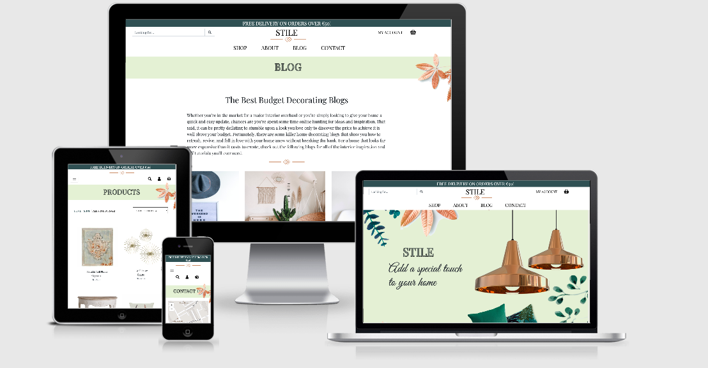

## Summary
* [Responsiveness](#responsiveness)
* [Overall](#overall)
    * [Navigation](#navigation)
    * [Carousel](#Carousel)
    * [Button "Go to top"](#button-go-to-top)
    * [Footer](#footer)
* [Home](#home)
* [Shop](#shop)
* [Comments](#comments)
* [Cart & Checkout](#cart-checkout)
* [Reviews](#reviews)
* [Account](#account)
    * [Registration](#registration)
    * [Sign In](#sign-in)
    * [Profile](#profile)
    * [Orders](#orders)
    * [Log out](#log-out)

**Back to [Readme.md](README.md)**

****

## Responsiveness

This site was was tested on multiple browsers (Google Chrome, Mozzila Firefox and Opera), multiple mobile devices (Samsung Galaxy, Huawei, Sony) and tablet device(Samsung Galaxy Tab) and it shown responsivness and compatibility. Web-site is responsive for screens from 350px to 2k. Everything is in order and responsive. But, viewing it on a 4k desktop, Background pictures are too small and they cover 2/3 of the width.

| Functionality | Expected Outcome | Actual Outcome | Pass/Fail |
| :-------------: |:----------------:| :--------------: | :---------: |
| Viewing on mobile device | Images adapted, no overflow | As Expected | Pass |
| Viewing on tablet device | Pages rendering properly, no distortion | As expected | Pass |
| Viewing on laptop device | All in order, no distortion | As expected | Pass |
| Viewing on desktop device up to 2k | All in order, no distortion | As expected | Pass |

## Overall

### Navigation

| Functionality | Expected Outcome | Actual Outcome | Pass/Fail |
| :-------------: |:----------------:| :--------------: | :---------: |
| Clicking on Logo button | Opens "Index" page | As Expected | Pass |
| Clicking on `shop` link | Opens dropdown tab with links | As expected | Pass |
| Clicking on `log In` link | Opens Log In page | As expected | Pass |
| Clicking on `Register` link | Opens Register page | As expected | Pass |
| Clicking on `my account` link | Opens dropdown tab with links | As expected | Pass |
| Clicking on `log Out` link | Logs out user and redirects to log in page | As expected | Pass |

### Carousel

| Functionality | Expected Outcome | Actual Outcome | Pass/Fail |
| :-------------: |:----------------:| :--------------: | :---------: |
| Clicking on Previous and Next button	| Slides testimonials | As Expected | Pass
| Clicking on indicators at the bottom	| Slides to selected testimonal | As expected | Pass

### Button "Go to top" (only on mob and tablet)

| Functionality | Expected Outcome | Actual Outcome | Pass/Fail |
| :-------------: |:----------------:| :--------------: | :---------: |
| Clicking on Go to top button | Scrolls up to top of the page | As Expected | Pass

### Footer

| Functionality | Expected Outcome | Actual Outcome | Pass/Fail |
| :-------------: |:----------------:| :--------------: | :---------: |
| Clicking on `Facebook` icon | Opens Facebook website in new tab | As expected | Pass |
| Clicking on `Instagram` icon | Opens Instagram website in new tab | As expected | Pass |
| Clicking on `YouTube` icon | Opens YouTube website in new tab | As expected | Pass |
| Clicking on `Pinterest` icon | Opens Pinterest website in new tab | As expected | Pass |
| Clicking on nav menu link | Opens the appropriate web page | As expected | Pass |

## Home

| Functionality | Expected Outcome | Actual Outcome | Pass/Fail |
| :-------------: |:----------------:| :--------------: | :---------: |
| Clicking on product cards | Opens the selected product detail | As expected | Pass |
| Clicking on `shop` button | Opens the products page | As expected | Pass |
| Clicking on `Email` icon | Opens email modal to contact site owner | As expected | Pass |

## Shop

| Functionality | Expected Outcome | Actual Outcome | Pass/Fail |
| :-------------: |:----------------:| :--------------: | :---------: |
| Clicking on filter button | Show products under that category | As Expected | Pass
| Clicking on product | Show product details info on a new page | As Expected | Pass
| Selecting the number in input and clicking "Add" | Adds the selected quantity of the item to cart and then opens "Shop" page |As Expected | Pass
| Clicking on breadcrumbs `shop` button | Opens "Shop" page | As Expected | Pass

## Comments

| Functionality | Expected Outcome | Actual Outcome | Pass/Fail |
| :-------------: |:----------------:| :--------------: | :---------: |
| Clicking on `Submit` button without filling all the forms | Displays Validation to tell the user to enter all the forms | As Expected | Pass |
| Clicking on `Submit` | shows success message if sent | As Expected | Pass
| Clicking on `Submit` | shows failure message if unable to sent | As Expected | Pass

## Cart & Checkout

| Functionality | Expected Outcome | Actual Outcome | Pass/Fail |
| :-------------: |:----------------:| :--------------: | :---------: |
| If no items, clicking on `Shop` button | Shows "Shop" page | As Expected | Pass
| Changing quantity and clicking on Amend button | Changes quantity of product and shows "Cart" page. If quantity changed to zero, removes product from cart | As Expected | Pass
| Clicking on products image and/or name |S hows that products detail page | As Expected | Pass
| Clicking on `Checkout` button | Opens "Chekout" page | As Expected | Pass
| Clicking on `Submit` button without filling the form | Redirects user to required field | As Expected | Pass
| Clicking on `Submit` button after filling out the form | Checks with Stripe if everything is ok and redirects to "Cart" page | As Expected | Pass

## Reviews

| Functionality | Expected Outcome | Actual Outcome | Pass/Fail |
| :-------------: |:----------------:| :--------------: | :---------: |
| Clicking on `Submit` button without filling all the forms | Displays Validation to tell the user to enter all the forms | As Expected | Pass |
| After clicking on `Add` button | User is redirected to "Products" page, their review now sucessfully showing | As Expected | Pass |
| Clicking on `Edit` symbol | User is redirected to "Edit your review" modal with previous information showing | As Expected | Pass |
| Clicking on `Delete` symbol | user is directed to modal to delete their review | As Expected | Pass |

## Account

### Registration

| Functionality | Expected Outcome | Actual Outcome | Pass/Fail |
| :-------------: |:----------------:| :--------------: | :---------: |
| Clicking on Register button | Registers the user and redirects to confirm email address. If registration form is incomplete, shows Please fill out this field | As Expected | Pass

### Sign in

| Functionality | Expected Outcome | Actual Outcome | Pass/Fail |
| :-------------: |:----------------:| :--------------: | :---------: |
| Clicking on `Log In` with correct username and password | Directs user to the index page | As Expected | Pass |
| Clicking on `Log In` with Incorrect username and password | flash message to user showing incorrect username or password | As Expected | Pass |
| Clicking on Forgot password | Opens "Forgot password" page | As Expected | Pass

### Profile

| Functionality | Expected Outcome | Actual Outcome | Pass/Fail |
| :-------------: |:----------------:| :--------------: | :---------: |
| Clicking on Edit profile button | Opens "Edit profile" page |As Expected | Pass
| Clicking on `Update` button | Saves changes to profile and redirects to "Profile" page | As Expected | Pass

### Orders

| Functionality | Expected Outcome | Actual Outcome | Pass/Fail |
| :-------------: |:----------------:| :--------------: | :---------: |
| If no items, clicking on `Shop` button | Shows "Shop" page | As Expected | Pass
| Clicking on a `order history` | Shows user's previous orders with all information | As Expected | Pass

### Log Out

| Functionality | Expected Outcome | Actual Outcome | Pass/Fail |
| :-------------: |:----------------:| :--------------: | :---------: |
| clicking on `Shop` button | Shows "Shop" page | As Expected | Pass
| Clicking on `log Out` button | Logs out user and redirects to index page | As expected | Pass |

**Back to [Top](testing.md)**

