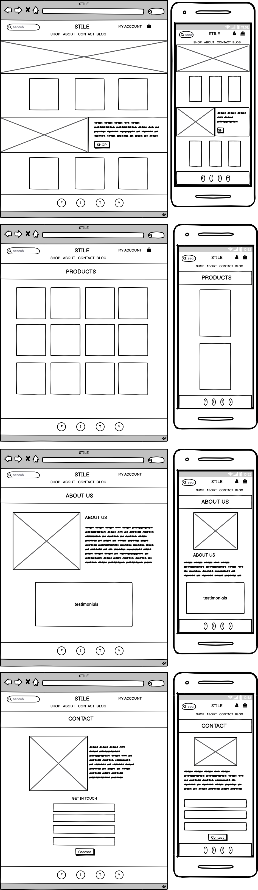
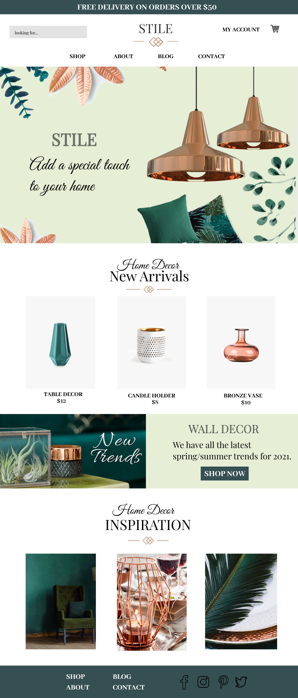
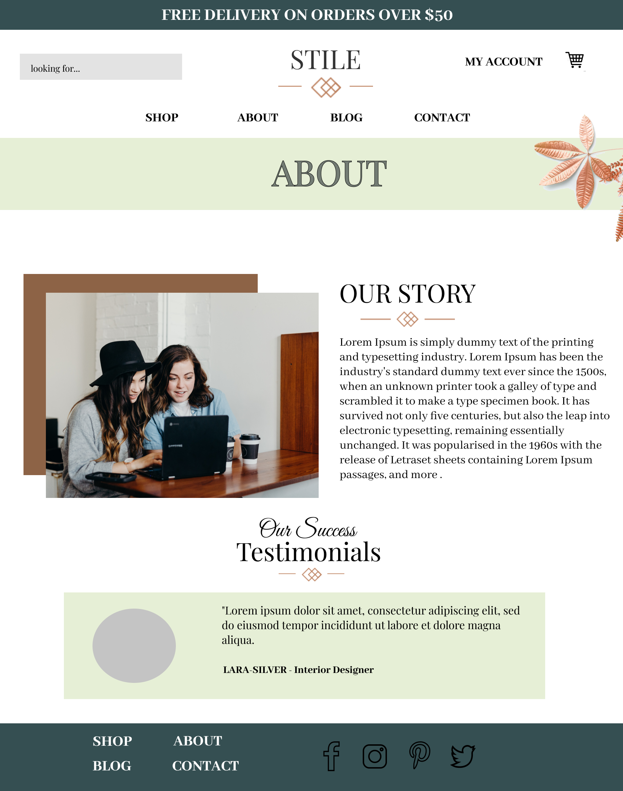
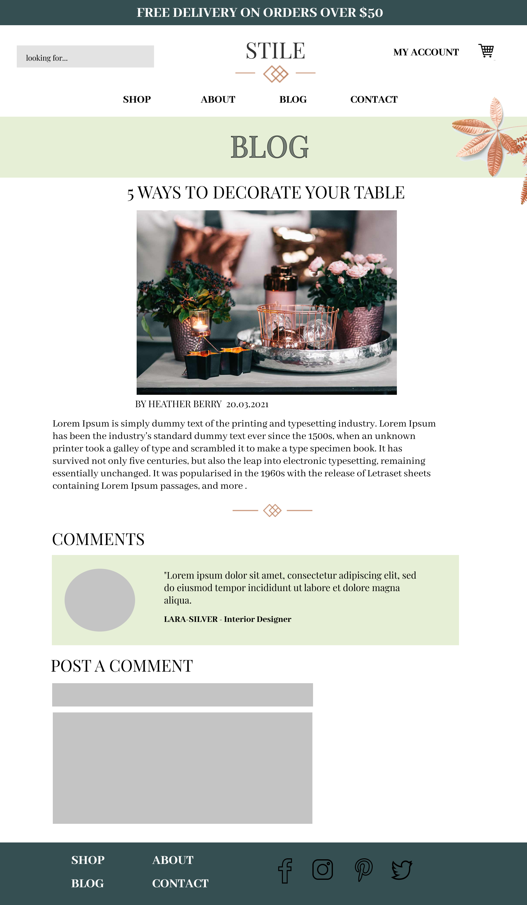
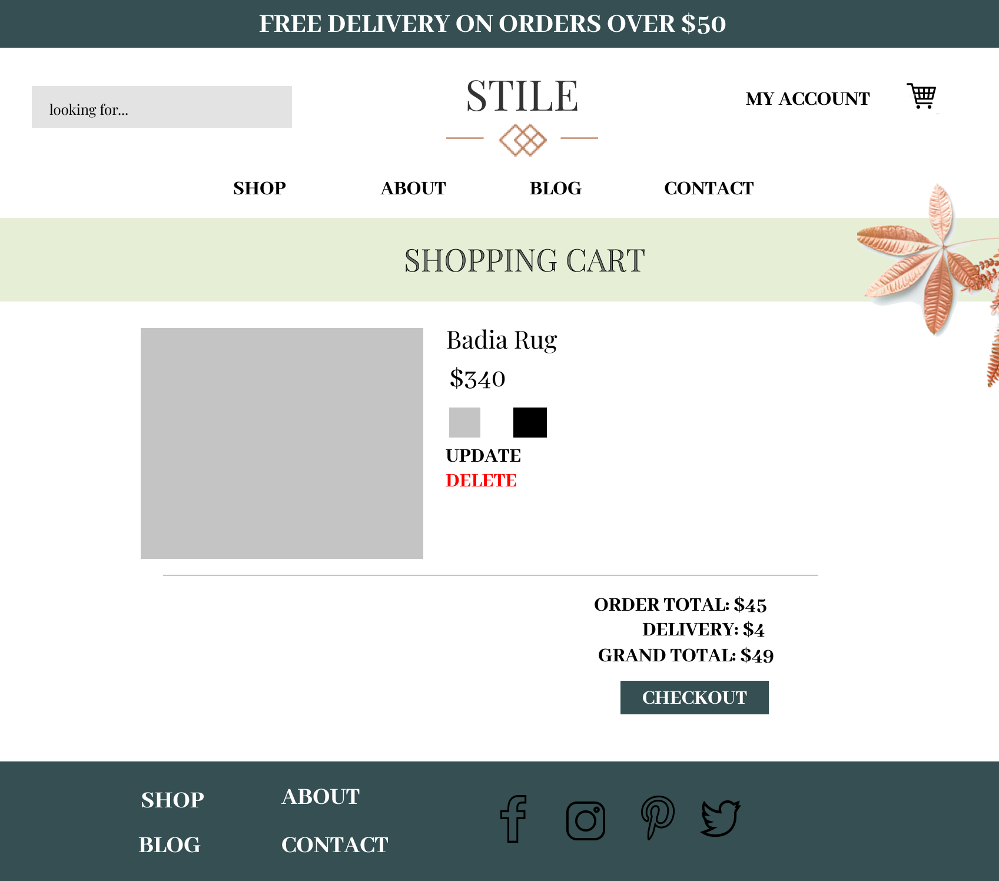
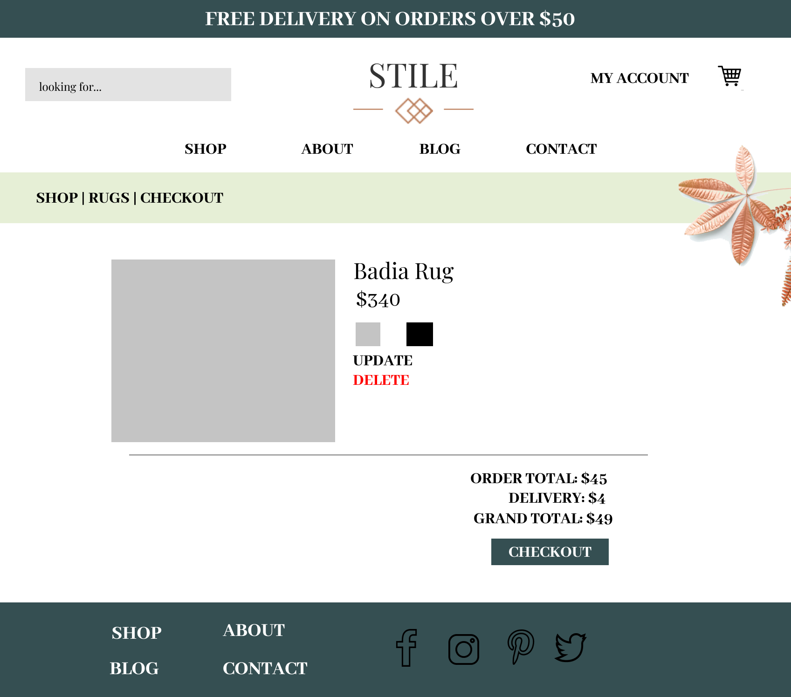
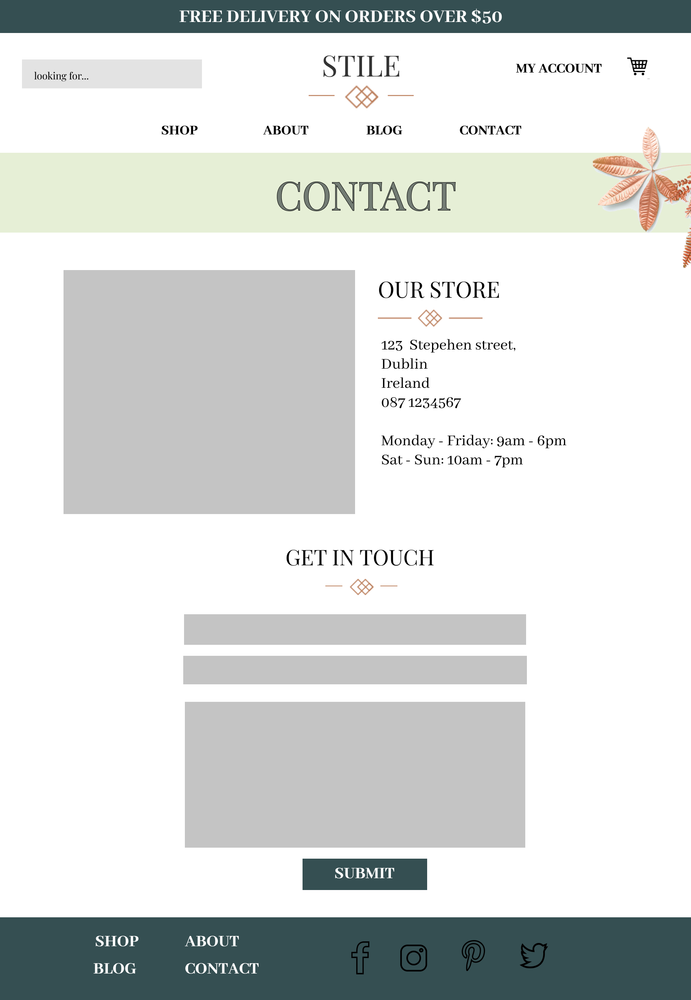
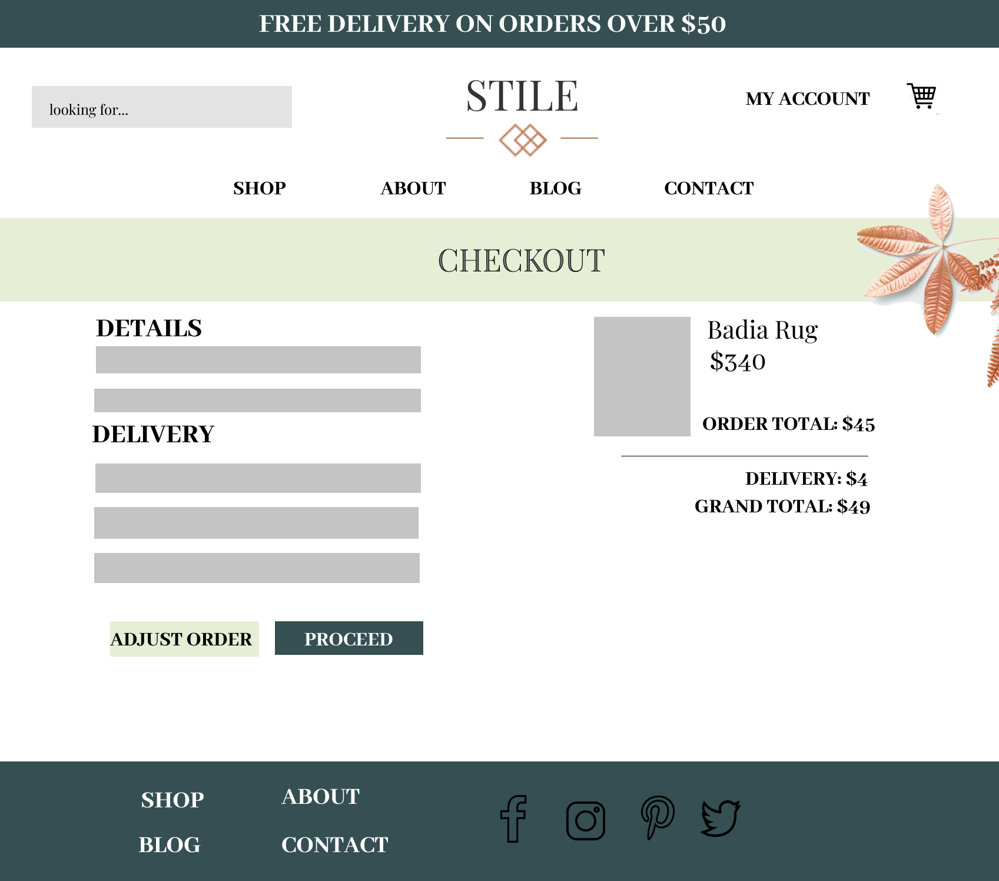
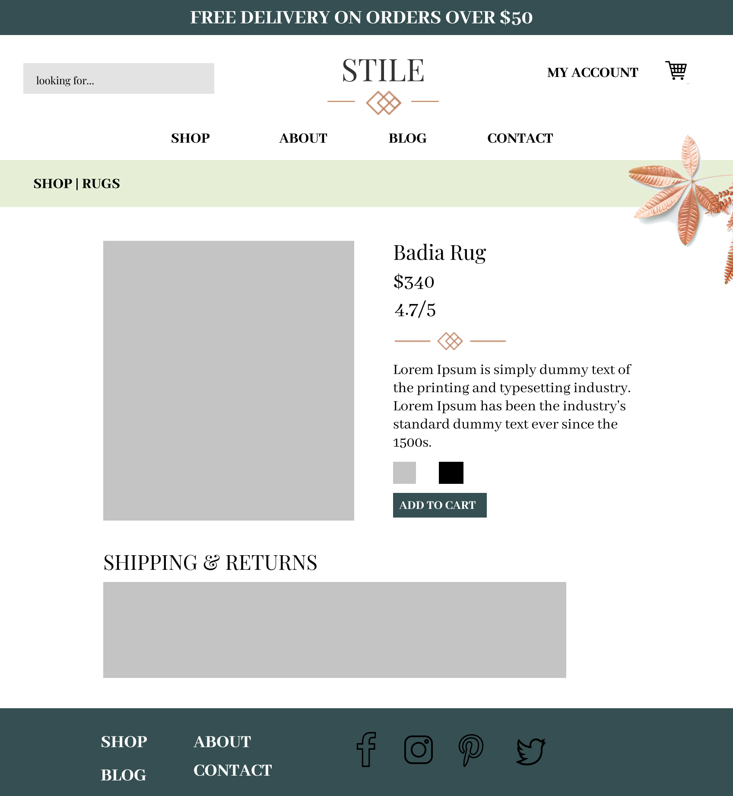
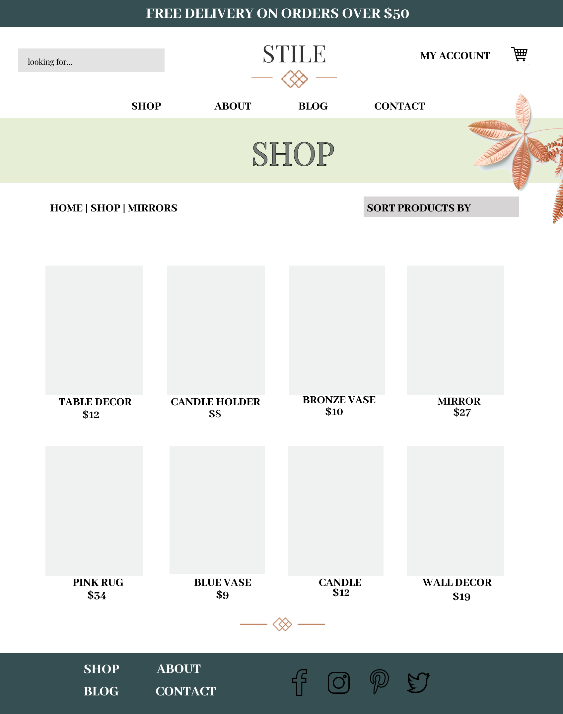

### The following wireframes were made using [Balsamiq](https://balsamiq.com/). 
  

### I Also used [Figma](https://www.figma.com/files/recent) to get a better visual idea of the look i wanted to go for.
  
  
  
  
  
  
  
  
  

